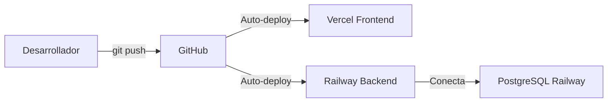

# 🚀 Despliegue en Producción - InmuebleManager

## 📋 Resumen Ejecutivo

La aplicación InmuebleManager se despliega en servicios cloud gratuitos utilizando una arquitectura de **Continuous Deployment (CD)** donde cada cambio en el repositorio Git se despliega automáticamente.

**Servicios utilizados:**
- **Frontend:** Vercel
- **Backend:** Railway
- **Base de Datos:** PostgreSQL en Railway

---

## 🏗️ Arquitectura de Despliegue

### Ambientes Separados

El proyecto mantiene **dos ambientes completamente independientes**:

#### 1. **Desarrollo (Local)**
```
┌─────────────────────────────────────────┐
│          PC del Desarrollador           │
│                                         │
│  Frontend (ng serve)                    │
│  └─ http://localhost:4200              │
│         ↓                               │
│  Backend (Spring Boot desde IDE)        │
│  └─ http://localhost:8080              │
│         ↓                               │
│  PostgreSQL Local                       │
│  └─ localhost:5432/gestion_inmuebles   │
└─────────────────────────────────────────┘
```

**Características:**
- Todos los servicios corren en la máquina local
- Datos de prueba independientes
- Para desarrollo y testing

#### 2. **Producción (Cloud)**
```
┌─────────────────────────────────────────────┐
│              INTERNET                       │
│                                             │
│  Usuario → Vercel (Frontend)                │
│            └─ https://tu-app.vercel.app     │
│                    ↓ HTTP/HTTPS             │
│            Railway (Backend)                │
│            └─ https://inmueblemanager-      │
│               production.up.railway.app     │
│                    ↓ TCP                    │
│            PostgreSQL (Railway)             │
│            └─ Base de datos en la nube      │
└─────────────────────────────────────────────┘
```

**Características:**
- Servicios desplegados en la nube 24/7
- Accesible desde cualquier dispositivo con internet
- Datos de producción reales
- Para usuarios finales

---

## 🔄 Flujo de Trabajo (Continuous Deployment)



### Proceso Completo

1. **Desarrollo Local**
   ```bash
   # Desarrollador trabaja en local
   git checkout -b feature/nueva-funcionalidad
   # Hace cambios, prueba localmente
   ```

2. **Commit y Push**
   ```bash
   git add .
   git commit -m "Implementar nueva funcionalidad"
   git push origin main
   ```

3. **Despliegue Automático**
   - **GitHub** detecta el push
   - **Vercel** detecta cambios en `main` → Redespliega frontend (1-2 min)
   - **Railway** detecta cambios en `main` → Redespliega backend (3-5 min)

4. **Resultado**
   - Los cambios están disponibles en producción automáticamente
   - No se requiere intervención manual

---

## ⚙️ Configuración Realizada

### 1. Frontend (Vercel)

#### Archivo: `inmuebleManagerFront/src/app/environment.ts`
```typescript
const BACKEND_LOCAL_URL = 'http://localhost:8080';
const BACKEND_PRODUCTION_URL = 'https://inmueblemanager-production.up.railway.app';

export function getApiBaseUrl(): string {
  if (typeof window === 'undefined') {
    return BACKEND_LOCAL_URL;
  }

  const hostname = window.location.hostname;

  // Si accedes desde Vercel (producción)
  if (hostname.includes('vercel.app')) {
    console.log('🌐 Acceso desde Vercel - Backend URL:', BACKEND_PRODUCTION_URL);
    return BACKEND_PRODUCTION_URL;
  }

  // Para localhost (desarrollo)
  console.log('💻 Acceso local - Backend URL:', BACKEND_LOCAL_URL);
  return BACKEND_LOCAL_URL;
}
```

**Funcionamiento:**
- Detecta automáticamente si se ejecuta en Vercel o localhost
- Cambia la URL del backend según el entorno
- No requiere cambios manuales al hacer deploy

#### Configuración en Vercel
1. Proyecto conectado a repositorio GitHub
2. **Root Directory:** `inmuebleManagerFront`
3. **Build Command:** `npm run build`
4. **Output Directory:** `dist/inmueble-manager-front/browser`
5. **Framework Preset:** Angular

---

### 2. Backend (Railway)

#### Archivos de Configuración

**`inmuebleManagerBack/Dockerfile`**
```dockerfile
# Multistage build para Spring Boot
FROM maven:3.9-eclipse-temurin-17 AS builder

WORKDIR /app
COPY . .
RUN mvn clean package -DskipTests

# Runtime stage
FROM eclipse-temurin:17-jdk-alpine

WORKDIR /app

# Copiar JAR generado
COPY --from=builder /app/target/*.jar app.jar

# Variables de entorno por defecto
ENV PORT=8080 \
    JAVA_OPTS="-Xmx512m -Xms256m" \
    SPRING_PROFILES_ACTIVE=prod

EXPOSE 8080

# Usar shell form para permitir expansión de variables
ENTRYPOINT java $JAVA_OPTS -Dserver.port=$PORT -Dspring.profiles.active=$SPRING_PROFILES_ACTIVE -jar app.jar
```

**`inmuebleManagerBack/railway.json`**
```json
{
  "$schema": "https://railway.app/railway.schema.json",
  "build": {
    "builder": "NIXPACKS",
    "buildCommand": "mvn clean package -DskipTests"
  },
  "deploy": {
    "startCommand": "java -Dserver.port=$PORT -Dspring.profiles.active=prod -jar target/*.jar",
    "restartPolicyType": "ON_FAILURE",
    "restartPolicyMaxRetries": 10
  }
}
```

**`inmuebleManagerBack/system.properties`**
```properties
java.runtime.version=17
```

**`inmuebleManagerBack/Procfile`**
```
web: java -Dserver.port=$PORT -Dspring.profiles.active=prod -jar target/*.jar
```

#### Variables de Entorno en Railway

```bash
SPRING_PROFILES_ACTIVE=prod
JWT_SECRET=miClaveSecretaSuperLargaYSeguraParaProduccion12345678901234567890
DB_HOST=${{Postgres.RAILWAY_PRIVATE_DOMAIN}}
DB_PORT=${{Postgres.PGPORT}}
DB_NAME=${{Postgres.POSTGRES_DB}}
DB_USER=${{Postgres.POSTGRES_USER}}
DB_PASSWORD=${{Postgres.POSTGRES_PASSWORD}}
```

**Nota:** Railway expande automáticamente las referencias `${{Postgres.*}}` con los valores de la base de datos PostgreSQL.

#### Configuración en Railway
1. Proyecto conectado a repositorio GitHub
2. **Root Directory:** `inmuebleManagerBack`
3. **Builder:** Docker (detectado automáticamente por `Dockerfile`)
4. **Puerto:** 8080 (configurado en Service Domain)
5. **Dominio Público:** Generado automáticamente

---

### 3. Base de Datos (PostgreSQL en Railway)

#### Configuración de Producción

**`inmuebleManagerBack/src/main/resources/application-prod.properties`**
```properties
# Puerto del servidor
server.port=8080

# DATABASE - PRODUCCIÓN (variables de entorno)
spring.datasource.url=jdbc:postgresql://${DB_HOST}:${DB_PORT}/${DB_NAME}
spring.datasource.username=${DB_USER}
spring.datasource.password=${DB_PASSWORD}
spring.datasource.driver-class-name=org.postgresql.Driver

# JPA / HIBERNATE - PRODUCCIÓN
# update: Crea/actualiza tablas automáticamente según las entidades
spring.jpa.hibernate.ddl-auto=update
spring.jpa.show-sql=false
spring.jpa.properties.hibernate.format_sql=false
spring.jpa.properties.hibernate.dialect=org.hibernate.dialect.PostgreSQLDialect

# LOGGING - PRODUCCIÓN
logging.level.root=WARN
logging.level.com.inmueblemanager=INFO
logging.file.name=logs/application.log

# JWT - PRODUCCIÓN
app.jwt.secret=${JWT_SECRET}
app.jwt.expiration=${JWT_EXPIRATION:3600000}

# MULTIPART / FILE UPLOADS
server.tomcat.max-http-post-size=20MB
spring.servlet.multipart.max-file-size=20MB
spring.servlet.multipart.max-request-size=20MB
```

**Características:**
- `ddl-auto=update`: Crea automáticamente las tablas basándose en las entidades JPA
- La primera vez que se despliega, crea toda la estructura de base de datos
- Base de datos empieza vacía (sin datos de desarrollo)
- Variables de entorno manejadas por Railway

---

### 4. Configuración CORS

Para permitir que el frontend en Vercel acceda al backend en Railway:

**`inmuebleManagerBack/src/main/java/com/inmueblemanager/config/CorsConfig.java`**
```java
@Configuration
public class CorsConfig implements WebMvcConfigurer {

    @Override
    public void addCorsMappings(CorsRegistry registry) {
        registry.addMapping("/**")
                .allowedOriginPatterns(
                    "http://localhost:4200",      // Desarrollo local
                    "https://*.vercel.app",       // Producción en Vercel
                    "https://*.railway.app"       // Railway (por si acaso)
                )
                .allowedMethods("GET", "POST", "PUT", "DELETE", "OPTIONS", "PATCH")
                .allowedHeaders("*")
                .exposedHeaders("Authorization", "Content-Type")
                .allowCredentials(true)
                .maxAge(3600);
    }
}
```

**`inmuebleManagerFront/src/app/interceptors/auth.interceptor.ts`**
```typescript
export const authInterceptor: HttpInterceptorFn = (req, next) => {
  const authService = inject(AuthService);

  // Configurar withCredentials para CORS
  if (req.url.includes('/api/auth/login') || req.url.includes('/api/auth/registro')) {
    const clonedReq = req.clone({ withCredentials: true });
    return next(clonedReq);
  }

  const token = authService.getToken();
  let clonedReq = req;
  
  if (token) {
    clonedReq = req.clone({
      setHeaders: { Authorization: `Bearer ${token}` },
      withCredentials: true
    });
  } else {
    clonedReq = req.clone({ withCredentials: true });
  }

  return next(clonedReq);
};
```

---

## 🔐 Seguridad

### Variables de Entorno
- **Nunca** se suben credenciales al repositorio
- Todas las claves sensibles se configuran como variables de entorno en Railway:
  - `JWT_SECRET`: Clave para firmar tokens JWT
  - `DB_PASSWORD`: Contraseña de la base de datos
  - Etc.

### CORS
- Configurado específicamente para:
  - Desarrollo local (`localhost:4200`)
  - Producción en Vercel (`*.vercel.app`)
- Rechaza peticiones de otros orígenes

### HTTPS
- Vercel proporciona HTTPS automáticamente
- Railway proporciona HTTPS automáticamente
- Toda la comunicación en producción es cifrada

---

## 📊 Monitoreo y Logs

### Vercel
1. Dashboard de Vercel → Proyecto → **Deployments**
2. Ver logs de build y runtime
3. Analíticas de tráfico

### Railway
1. Dashboard de Railway → Servicio → **Deployments**
2. Ver logs en tiempo real:
   - Build logs (compilación Maven)
   - Application logs (Spring Boot)
3. Métricas de CPU, memoria, red

### PostgreSQL (Railway)
1. Dashboard de Railway → Postgres → **Metrics**
2. Ver conexiones activas
3. Uso de almacenamiento

---

## 🚀 Proceso de Despliegue Inicial

### Paso 1: Configurar Vercel

1. Ir a [vercel.com](https://vercel.com) y conectar GitHub
2. Importar repositorio `InmuebleManager`
3. Configurar:
   - **Root Directory:** `inmuebleManagerFront`
   - **Framework Preset:** Angular
4. Deploy

### Paso 2: Configurar Railway

1. Ir a [railway.app](https://railway.app) y conectar GitHub
2. **Crear nuevo proyecto** → **Deploy from GitHub repo**
3. Seleccionar repositorio `InmuebleManager`
4. **Agregar PostgreSQL**:
   - En el proyecto: **+ New** → **Database** → **Add PostgreSQL**
5. **Configurar servicio backend**:
   - **Settings** → **Root Directory:** `inmuebleManagerBack`
   - **Variables** → Agregar todas las variables de entorno
6. **Generar dominio público**:
   - **Settings** → **Networking** → **Generate Domain**
   - Puerto: `8080`

### Paso 3: Conectar Frontend con Backend

1. Copiar URL del backend generada por Railway
2. Actualizar `inmuebleManagerFront/src/app/environment.ts`:
   ```typescript
   const BACKEND_PRODUCTION_URL = 'https://tu-url-railway.up.railway.app';
   ```
3. Commit y push:
   ```bash
   git add .
   git commit -m "Configurar URL de backend en producción"
   git push
   ```
4. Vercel redesplegará automáticamente

---

## 🔧 Mantenimiento

### Actualizar la Aplicación

```bash
# 1. Hacer cambios en el código
# 2. Probar localmente
# 3. Commit y push
git add .
git commit -m "Descripción de los cambios"
git push origin main

# 4. Automático:
#    - Vercel redespliega frontend (1-2 min)
#    - Railway redespliega backend (3-5 min)
```

### Ver Logs de Errores

**Vercel:**
```
Dashboard → Proyecto → Deployments → [último deployment] → View Function Logs
```

**Railway:**
```
Dashboard → Servicio → Deployments → [último deployment] → View Logs
```

### Rollback (Volver a Versión Anterior)

**Vercel:**
1. Dashboard → Deployments
2. Encontrar deployment anterior que funcionaba
3. Clic en **"..."** → **"Redeploy"**

**Railway:**
1. Dashboard → Deployments
2. Encontrar deployment anterior
3. Clic en **"Redeploy"**

---

## 💰 Costos y Límites

### Vercel (Plan Gratuito)
- ✅ 100 GB de ancho de banda/mes
- ✅ Despliegues ilimitados
- ✅ HTTPS automático
- ✅ SSL incluido

### Railway (Plan Gratuito)
- ✅ $5 USD de crédito mensual
- ✅ Suficiente para proyectos pequeños/medianos
- ✅ PostgreSQL incluida (512 MB)
- ⚠️ Si se acaba el crédito, la app se pausa hasta el siguiente mes

---

## 📝 Ventajas de Esta Arquitectura

1. **Separación de Ambientes**
   - Desarrollo no afecta producción
   - Datos separados

2. **Continuous Deployment Automático**
   - Un simple `git push` actualiza producción
   - No hay pasos manuales

3. **Escalabilidad**
   - Fácil migrar a planes de pago si crece el proyecto
   - Infrastructure as Code (todo en Git)

4. **Gratuito**
   - Ideal para proyectos académicos/personales
   - Sin tarjeta de crédito requerida

5. **Profesional**
   - Mismo flujo que empresas reales
   - Experiencia práctica con CI/CD

---

## 🎯 Resumen para la Memoria

### Tecnologías de Despliegue

| Componente | Tecnología | Descripción |
|------------|------------|-------------|
| Frontend   | Vercel     | Hosting de aplicaciones Angular/React con CD automático |
| Backend    | Railway    | Hosting de aplicaciones Docker/Spring Boot |
| Base de Datos | PostgreSQL (Railway) | Base de datos relacional en la nube |
| Versionado | GitHub     | Control de versiones y trigger para despliegues |
| CI/CD      | Vercel + Railway | Despliegue automático en cada push a main |

### Diagrama de Arquitectura Final

```
┌────────────────────────────────────────────────────┐
│                    INTERNET                        │
│                                                    │
│  ┌──────────────┐                                 │
│  │   Usuario    │                                 │
│  └──────┬───────┘                                 │
│         │ HTTPS                                   │
│         ↓                                         │
│  ┌──────────────────────┐                        │
│  │  Vercel (Frontend)   │                        │
│  │  - Angular 18        │                        │
│  │  - Auto-deploy       │                        │
│  │  - HTTPS incluido    │                        │
│  └──────────┬───────────┘                        │
│             │ HTTPS                               │
│             ↓                                     │
│  ┌──────────────────────┐                        │
│  │  Railway (Backend)   │                        │
│  │  - Spring Boot 3     │                        │
│  │  - Docker            │                        │
│  │  - Auto-deploy       │                        │
│  └──────────┬───────────┘                        │
│             │ TCP                                 │
│             ↓                                     │
│  ┌──────────────────────┐                        │
│  │  PostgreSQL          │                        │
│  │  - Railway           │                        │
│  │  - 512 MB storage    │                        │
│  └──────────────────────┘                        │
│                                                    │
└────────────────────────────────────────────────────┘

         ↑ Auto-deploy on git push
         │
┌────────┴────────┐
│     GitHub      │
│  (main branch)  │
└─────────────────┘
```

---

## 📚 Referencias

- [Documentación Vercel](https://vercel.com/docs)
- [Documentación Railway](https://docs.railway.app/)
- [Spring Boot Deployment](https://spring.io/guides/gs/spring-boot-docker/)
- [Angular Deployment](https://angular.io/guide/deployment)

---

**Fecha de última actualización:** Marzo 2026
**Versión del documento:** 1.0
